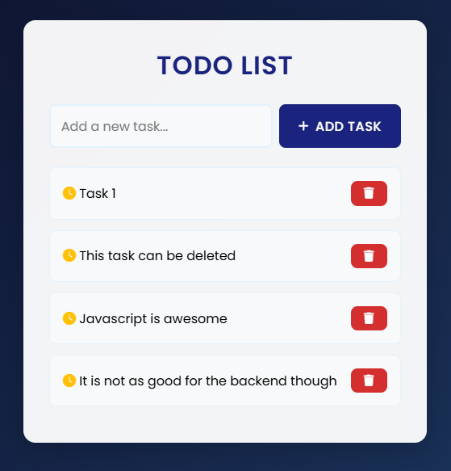
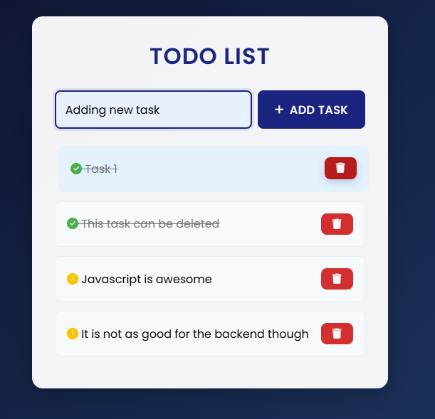
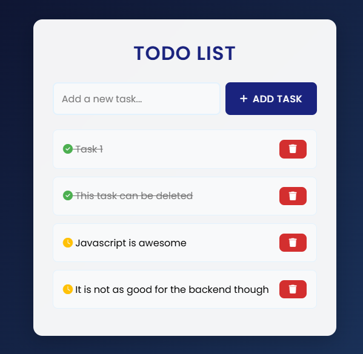

# Todo List Application

A simple and elegant Todo List application built with HTML, CSS, and JavaScript. This application allows users to manage their tasks efficiently with features like adding, completing, and deleting tasks.

## Features

- Add new tasks
- Mark tasks as complete/incomplete
- Delete tasks
- Persistent storage using localStorage
- Responsive design
- Clean and modern UI

## Screenshots

### Main Page


### Adding a Task


### Completed Tasks


## How to Run

1. Clone this repository or download the files
2. Open `index.html` in your web browser
3. Start adding your tasks!

## Usage

- To add a task: Type your task in the input field and click "Add Task" or press Enter
- To mark a task as complete: Click on the task text
- To delete a task: Click the "Delete" button next to the task

## Technologies Used

- HTML5
- CSS3
- JavaScript (ES6+)
- localStorage for data persistence

## Project Structure

```
todo-list/
├── index.html
├── style.css
├── script.js
└── README.md
```

## Contributing

Feel free to fork this repository and submit pull requests for any improvements.

## License

This project is open source and available under the MIT License. 