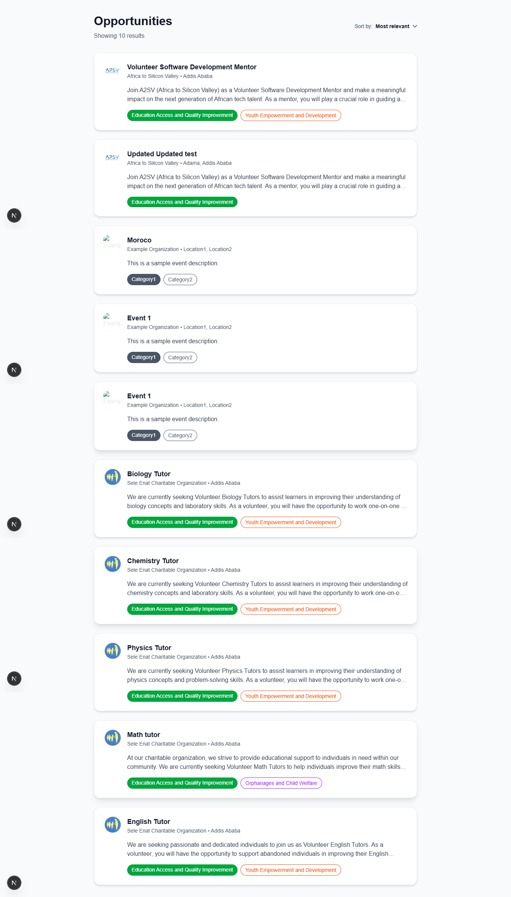
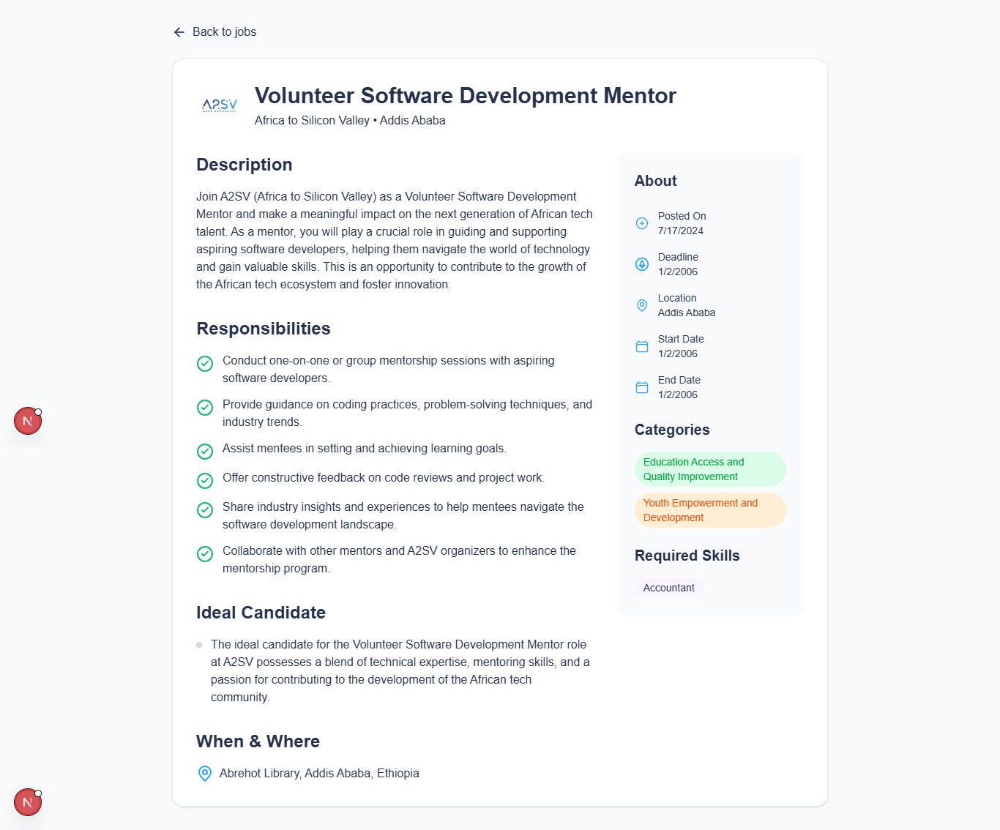
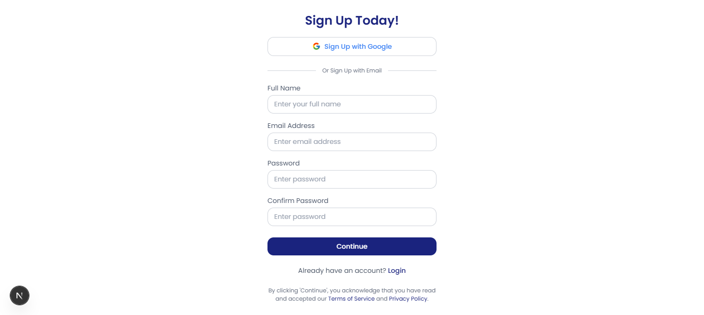
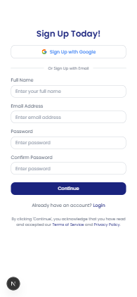
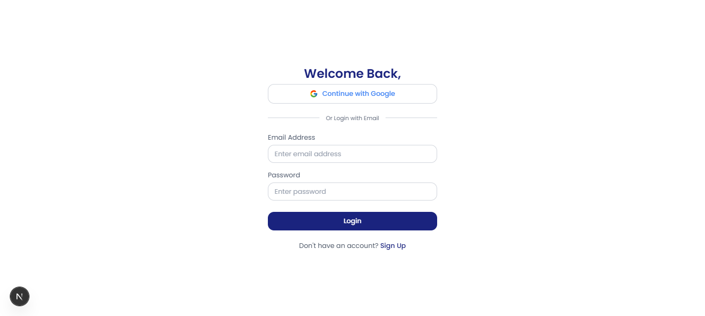
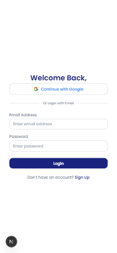
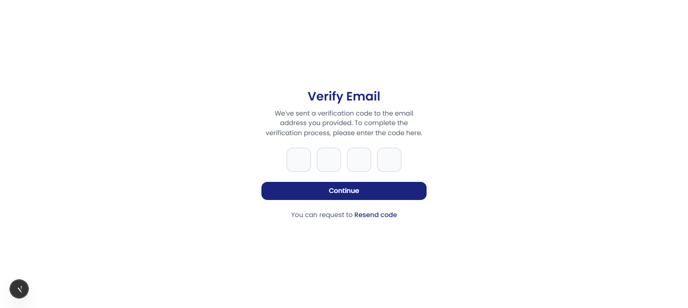
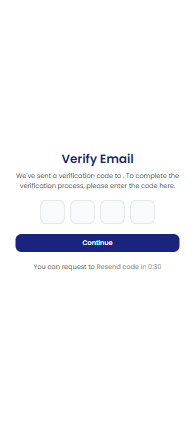

# Job Listing Application

A modern job listing application built with Next.js and Tailwind CSS that displays job opportunities in a clean and user-friendly interface.

## Features

- Clean and modern UI design
- Responsive layout that works on all devices
- Job cards with company logos
- Tag-based filtering system
- Detailed job descriptions
- Location and company information

## Screenshots

### Job Listing Page


### Job Details Page


### Sign Up Page
### Sign Up Page



### Login Page



### Email Verification Page




## Getting Started

1. Clone the repository
2. Install dependencies:
```bash
npm install
```

3. Run the development server:
```bash
npm run dev
```

4. Open [http://localhost:3000](http://localhost:3000) with your browser to see the result.

## Technologies Used

- Next.js 14
- Tailwind CSS
- React
- Node.js

## Project Structure

```
├── src/
│   ├── app/
│   │   ├── page.js         # Main page component
│   │   └── layout.js       # Root layout
│   └── components/
│       ├── JobCard.jsx     # Individual job card component
│       └── JobList.jsx     # Job listing container component
├── public/
│   └── ymca-logo.png      # Company logo
└── jobs.json              # Job listing data
```

## Contributing

Feel free to submit issues and enhancement requests.

## License

This project is licensed under the MIT License.
