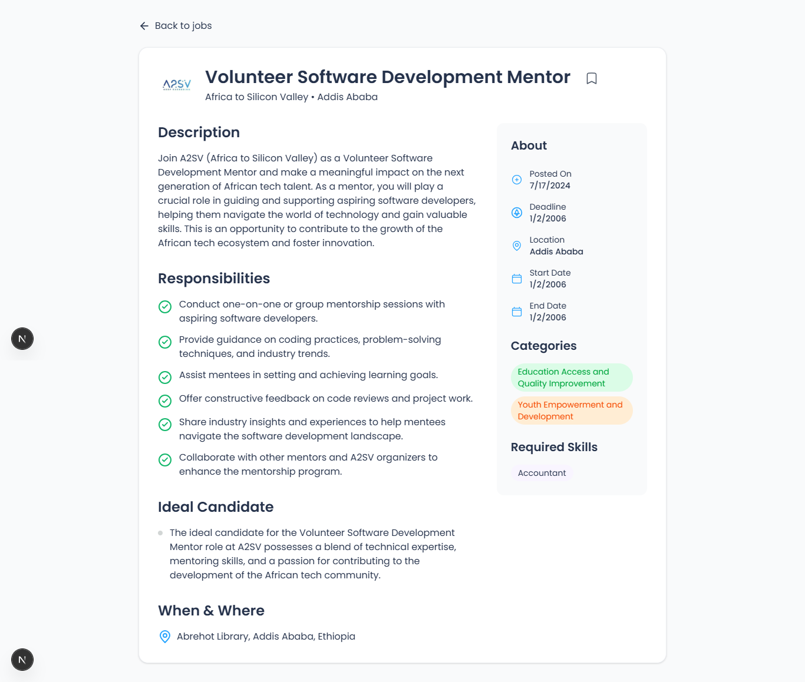
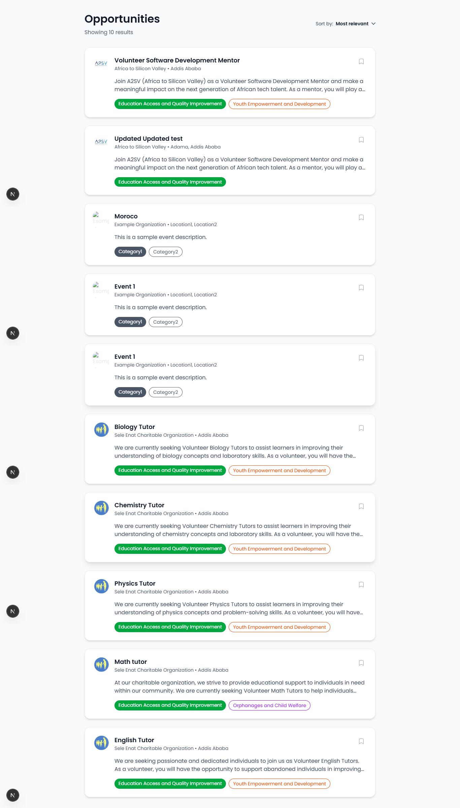
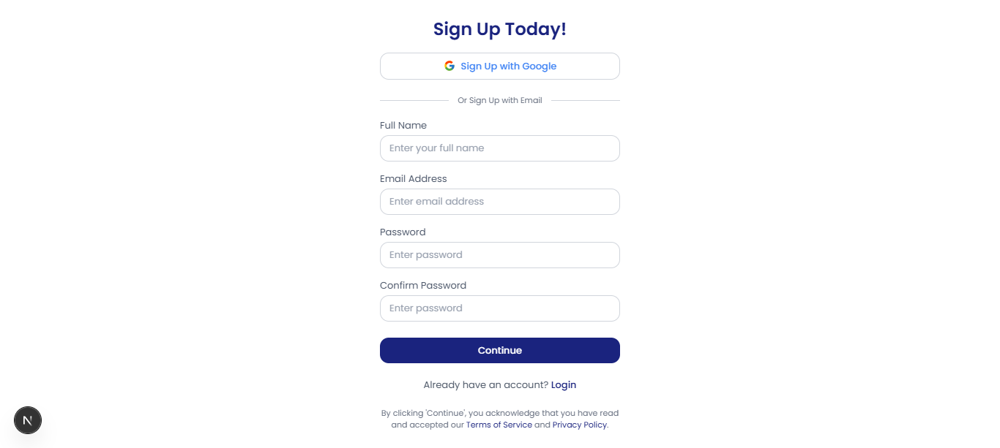
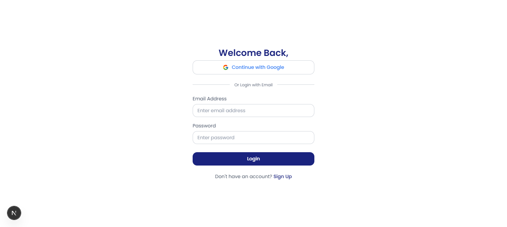
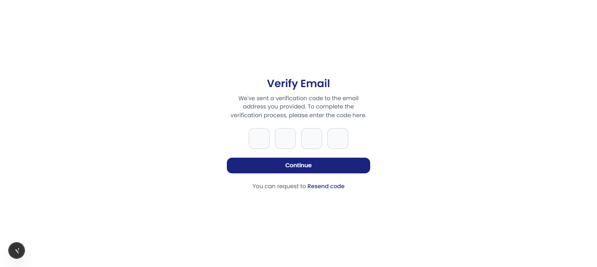
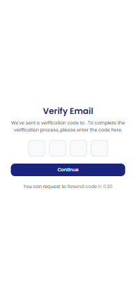

# Job Listing Application

A modern job listing application built with Next.js and Tailwind CSS that displays job opportunities in a clean and user-friendly interface.

## Features

- Clean and modern UI design
- Responsive layout that works on all devices
- Job cards with company logos
- Tag-based filtering system
- Detailed job descriptions
- Location and company information
- Bookmark functionality for authenticated users
- Comprehensive test coverage with Jest and Cypress

## Screenshots

### Job Listing Page with Bookmark


### Job Details Page with Bookmark


### Sign Up Page



### Login Page



### Email Verification Page



### Bookmark Functionality


## Getting Started

1. Clone the repository
2. Install dependencies:
```bash
npm install
```

3. Run the development server:
```bash
npm run dev
```

4. Open [http://localhost:3000](http://localhost:3000) with your browser to see the result.

## Testing

### Unit Tests
Run unit tests with Jest:
```bash
npm test
```

Run tests in watch mode:
```bash
npm run test:watch
```

### End-to-End Tests
Run Cypress tests in interactive mode:
```bash
npm run test:e2e
```

Run Cypress tests in headless mode:
```bash
npm run test:e2e:headless
```

## Technologies Used

- Next.js 14
- Tailwind CSS
- React
- Node.js
- Jest for unit testing
- Cypress for end-to-end testing

## Project Structure

```
├── src/
│   ├── app/
│   │   ├── page.js         # Main page component
│   │   └── layout.js       # Root layout
│   ├── components/
│   │   ├── JobCard.jsx     # Individual job card component
│   │   └── JobList.jsx     # Job listing container component
│   ├── context/
│   │   └── AuthContext.jsx # Authentication and bookmark context
│   └── services/
│       └── api.js          # API service functions
├── cypress/
│   └── e2e/
│       └── bookmark.cy.js  # Cypress end-to-end tests
├── src/components/__tests__/
│   └── JobCard.test.jsx    # Jest unit tests
├── public/
│   └── ymca-logo.png      # Company logo
└── jobs.json              # Job listing data
```

## Contributing

Feel free to submit issues and enhancement requests.

## License

This project is licensed under the MIT License.
